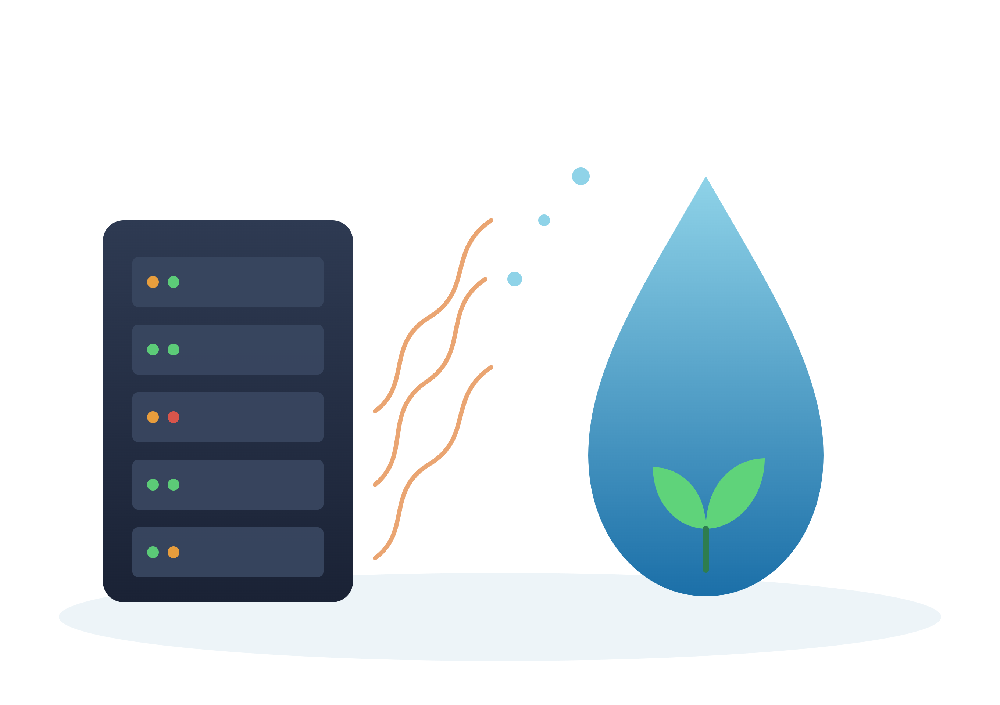
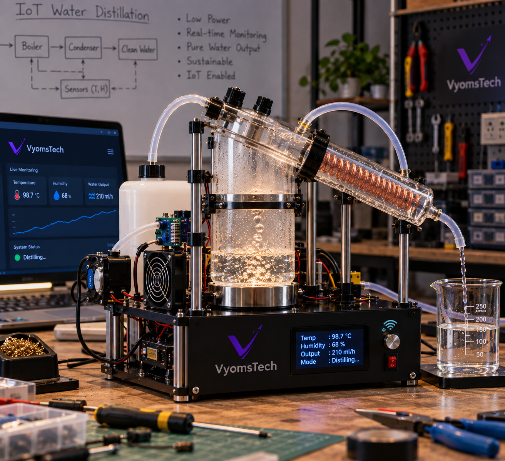
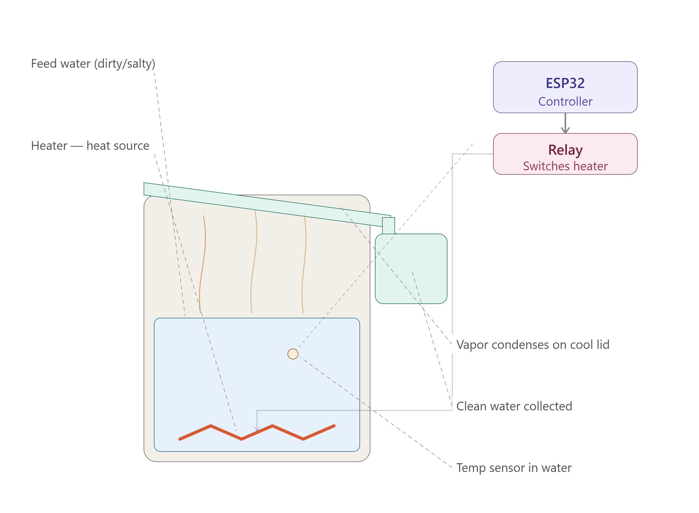

# How I Turned a Data Center's Waste Heat Into Drinking Water

Everyone talks about how much electricity AI eats. Almost nobody talks about the water. I started noticing it everywhere once I actually looked — articles about data centers being denied water permits, residents in drought-hit counties pushing back against new AI campuses, companies quietly signing deals to secure water rights for their server farms. It wasn't some abstract future risk. It was happening right now, in real places, to real communities. And once I saw it, I couldn't unsee it. So I decided to actually do something about it, at whatever small scale I could manage — and built my own system on my workbench to prove the concept out.

## The Problem I Wanted to Tackle

Everyone knows AI eats electricity. What fewer people realize is that keeping all those GPUs from melting down takes an enormous amount of water too — and it's not a small, abstract number. By 2025, data centers expanded for AI workloads were consuming nearly one trillion litres of water a year, with cooling systems that shed heat by evaporating water into the air being the main driver. That's not a future projection — that's where things already stood before 2026 even began.

And it's not evenly spread out either. It's concentrated in specific places, which makes the impact a lot more personal than a global number suggests. Take Northern Virginia — the single biggest data center hub in the world. Data centers there account for over 11% of all industrial water consumption in Loudoun County during the summer months, a time when local water resources are already under the most strain. That's not some distant statistic — that's a county where data centers are competing with regular households and farms for water, during the exact season when water is scarcest.

Or take Meta's campus in Prineville, Oregon. A single 35-megawatt expansion that came online in early 2026 disclosed annual water consumption of 1.1 billion gallons — and that's considered one of the more efficient sites, since it benefits from cooler regional temperatures and river access. Imagine what less-efficient campuses in hotter, drier regions are consuming.

What really got me was learning that AI workloads specifically make this worse, not just data centers in general. AI-optimized facilities consume somewhere between 15 to 20 percent more water per megawatt than conventional IT infrastructure, because the kind of dense, constant GPU load that training and running large models requires generates more heat, more continuously, than ordinary servers ever did.

On top of all that direct cooling water, there's a second layer most people never even think about: the electricity itself. Power plants — especially thermal ones — use water to generate the electricity that data centers pull from the grid. So the real water footprint of AI isn't just the water sprayed or evaporated on-site; it's that plus the water used far away, at a power plant, just to produce the electricity in the first place. Layer those two together, and the true cost of "just asking AI a question" becomes a lot less invisible than it feels.

The more I read, the more it felt less like an engineering curiosity and more like a question I genuinely wanted an answer to: if data centers are generating all this waste heat anyway, why isn't more of it being put to use? That question is what actually got me into the workshop.

## My Approach

Instead of letting heat go to waste, I wanted to put it to work — using it to purify water that would otherwise be undrinkable. I started researching ways to reclaim waste heat, and distillation kept coming up as the simplest, most provable method: use heat to evaporate water, leave the contaminants behind, then condense the vapor back into something clean. It's old technology, well understood, and exactly the kind of thing a student with a soldering iron and a weekend could actually build and test.

I used an ESP32 as a stand-in for a real data center's compute load — something that draws power, runs continuously, and generates heat as a byproduct, the same way a server rack does. Around that, I built a small distillation system.

Here's how it works: a sealed chamber holds dirty or salty feed water. A heater at the bottom — representing the "waste heat" a real server generates while cooling itself — warms the water until it evaporates. Since only pure H₂O turns to vapor, salts and impurities get left behind. That vapor rises and hits an angled lid that's cooler than the chamber, condensing back into liquid. Gravity does the rest — the droplets slide down the tilt and collect in a small cup as clean water.

I used the ESP32 to control the whole system — a relay switches the heater on and off, and a waterproof temperature sensor keeps constant watch, cutting the power automatically if things run too hot. Even the heat that doesn't go directly into evaporation isn't wasted entirely — condensation on the lid releases its own heat, which I'm using (with a metal lid and some fins) to help pre-warm the next batch of feed water before it even enters the chamber, so the next cycle needs a little less energy than the one before it.

Getting here wasn't instant. My first version of the chamber leaked at the seams, so I had to rethink the sealing entirely with proper silicone gaskets. My first heater placement didn't generate a steep enough temperature gradient between the water and the lid, so condensation barely happened at all — I had to redesign the lid angle and improve insulation around the chamber walls to hold the heat where it actually mattered. None of this was complicated engineering, but all of it took iteration, and that iteration is where most of the actual learning happened.

 

## What I Learned

Building this taught me more than I expected. I had to think seriously about heat recovery, safety cutoffs, and control logic — not just "make the heater turn on," but "make the heater turn on safely, and don't let anything overheat while I'm not watching it." It's the kind of hands-on systems thinking you don't really get from just writing code — there's a real, physical consequence if something goes wrong, not just a failed test case.

It also changed how I think about efficiency. Chasing "zero waste heat" turned out to be the wrong goal — the right goal was making sure whatever heat does get produced gets used at least once before it disappears into the air. That's a mindset shift that applies well beyond this one project — it's basically how every real industrial process thinks about energy, and it was useful to internalize that firsthand instead of just reading about it.

And honestly, it taught me patience. Every failed seal, every weak condensation cycle, every moment the temperature sensor cut the heater off right when I didn't want it to — all of that was frustrating in the moment, but it's also exactly the kind of debugging that doesn't show up in a textbook. You only learn it by building something physical and watching it fail in front of you.

## Why It Matters

My setup produces a small amount of water — nowhere near enough to matter at scale. That was never really the goal. What I wanted to show, for myself as much as anyone else, is that the "waste" byproducts of the infrastructure we're building don't have to stay waste. A little bit of engineering thinking can turn a discarded resource into something useful — and when you look at numbers like Loudoun County's 11% or Meta's 1.1 billion gallons a year, you realize that even small efficiency gains, multiplied across thousands of facilities, would genuinely matter.

As AI infrastructure keeps scaling up, I think ideas like this — heat recovery, underwater cooling, smarter resource loops — are going to matter more, not less. This project was my small attempt at exploring that space hands-on, rather than just reading about it from the sidelines. If a student with a few hundred rupees of parts and a weekend can prove the concept works at a tiny scale, it's worth asking what a team with real resources could do with the same idea at the scale that would actually move the needle.

  <strong>— Aman Mehta</strong>

print(abc)